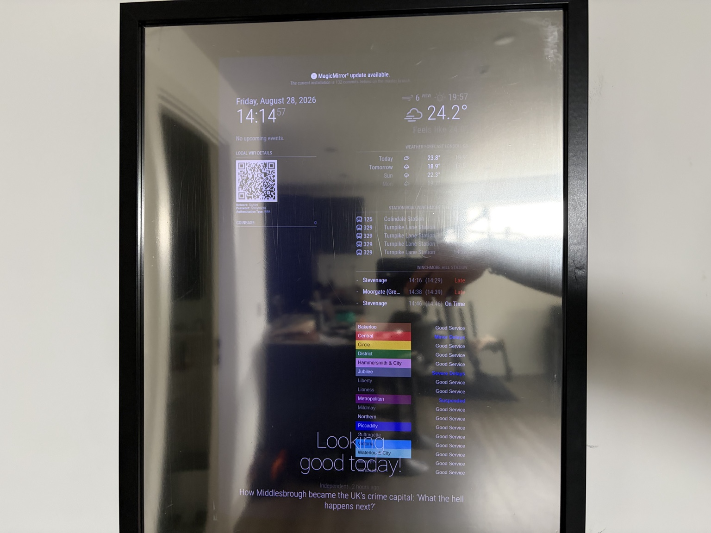
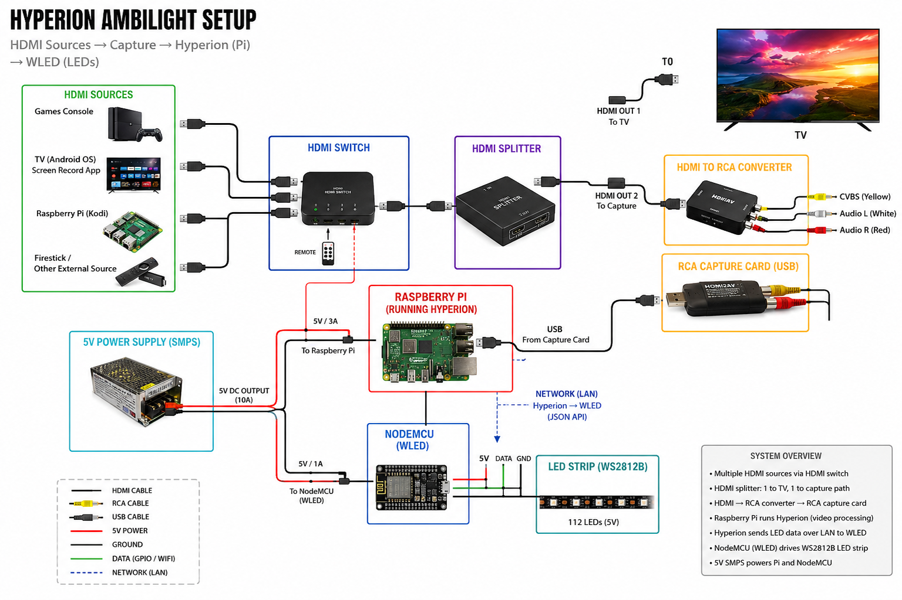
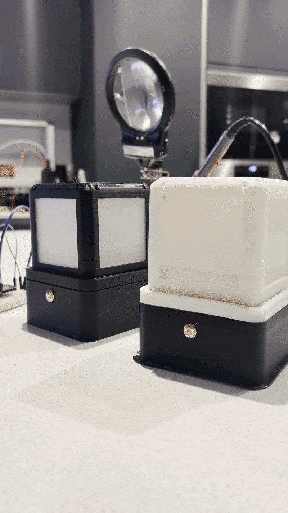

# Things I've Built 🔧

A collection of personal hardware, embedded, Raspberry Pi, IoT and 3D-printing projects.

I'm a technical recruiter specialising in embedded systems, electronics and deep-tech engineering. Outside of work, I like getting hands-on with the same kinds of technology I spend my working life around — wiring things together, writing code, designing parts, breaking things and figuring out why they don't work.

> These are personal projects, not professional engineering work. They're here because I enjoy understanding how things work and making them actually work.

## Featured projects

| Project | What I built | Main technologies |
|---|---|---|
| 🪞 [Magic Mirror](projects/magic-mirror/README.md) | A smart mirror built into IKEA frames around an old display | Raspberry Pi · Linux · MagicMirror · Docker · Cron |
| 🌈 [Hyperion Ambilight](projects/hyperion-ambilight/README.md) | Real-time TV backlighting driven from the HDMI signal | Raspberry Pi · Hyperion · WLED · WS2812B · HDMI |
| 🎮 [Raspberry Pi Media & Emulation](projects/raspberry-pi-media-emulation/README.md) | A combined media centre and retro gaming box | Raspberry Pi 5 · Kodi · RetroArch · Linux · NAS |
| 💡 [Wi-Fi Touch Lamps](projects/mqtt-touch-lamps/README.md) | Networked touch lamps with MQTT control | NodeMCU · TTP223 · MQTT · Wi-Fi · LEDs |
| 🔮 [Kyber Crystal Night Light](projects/kyber-crystal/README.md) | A removable illuminated 3D-printed crystal with magnetic docking | ESP32-C3 · WS2812B · CAD · 3D printing · Pogo pins |

---

## 🪞 Magic Mirror

A Raspberry Pi-powered smart mirror built from an old Dell monitor, two-way mirror material and IKEA frames. The display runs a customised MagicMirror setup with scheduled behaviour and modules for useful information.

**[→ Project details](projects/magic-mirror/README.md)**

---

## 🌈 Hyperion Ambilight

A DIY Ambilight-style system that captures an HDMI video feed, processes the image on a Raspberry Pi and sends lighting data over the network to WLED-controlled WS2812B LEDs.

**[→ Project details](projects/hyperion-ambilight/README.md)**

---

## 🎮 Raspberry Pi Media & Emulation Centre

A Raspberry Pi 5 used as a single living-room box for retro gaming and media playback, combining Linux, Kodi, RetroArch and network storage.

**[→ Project details](projects/raspberry-pi-media-emulation/README.md)**

---

## 💡 Wi-Fi Touch Lamps

Two custom 3D-printed lamps using capacitive touch input, a NodeMCU and MQTT over Wi-Fi to control addressable LEDs.

**[→ Project details](projects/mqtt-touch-lamps/README.md)**

---

## 🔮 Kyber Crystal Night Light

A removable 3D-printed crystal designed around a magnetic pogo-pin docking interface. The crystal contains addressable LEDs while an ESP32-C3 and power electronics sit in the base.

**[→ Project details](projects/kyber-crystal/README.md)**

---

## What these projects have in common

- Raspberry Pi and Linux
- ESP32 / NodeMCU microcontrollers
- Addressable LEDs and lighting control
- Wi-Fi, MQTT and networked devices
- Sensors and physical interfaces
- 3D CAD and 3D printing
- Hardware/software integration
- Debugging real-world systems
