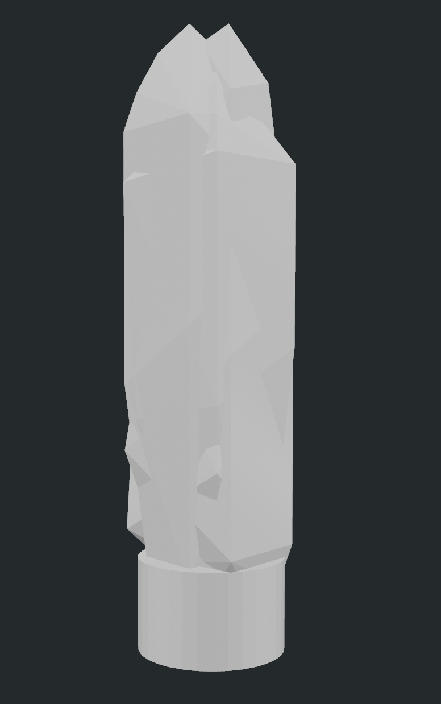
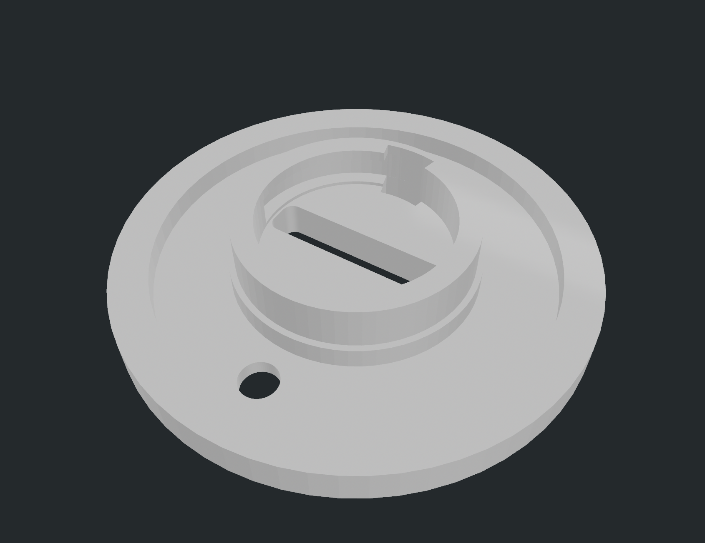
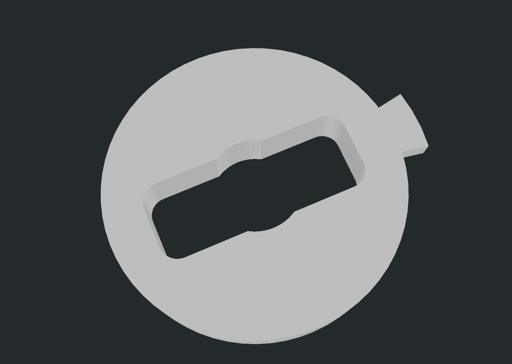
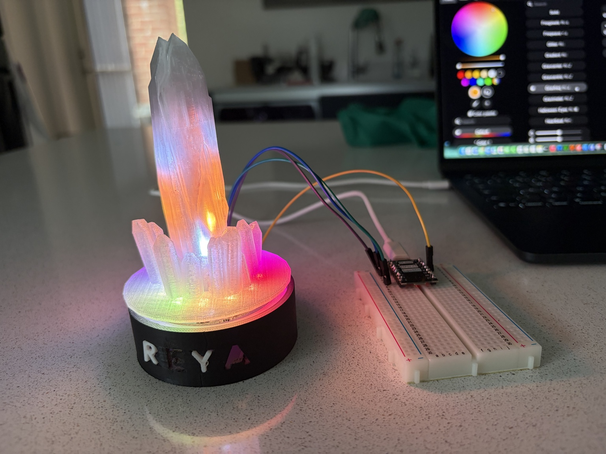
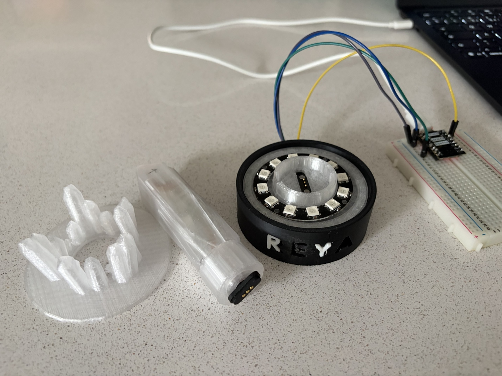
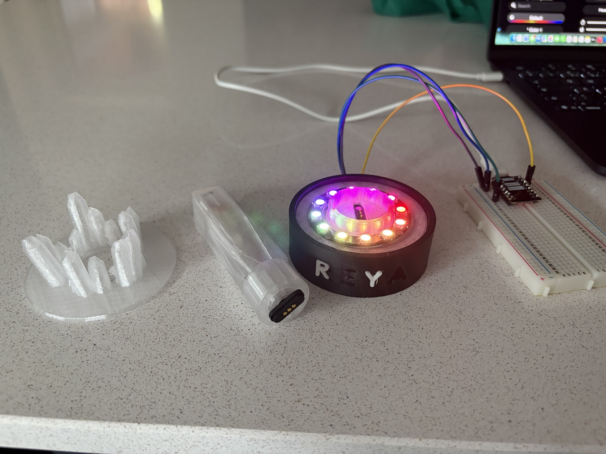
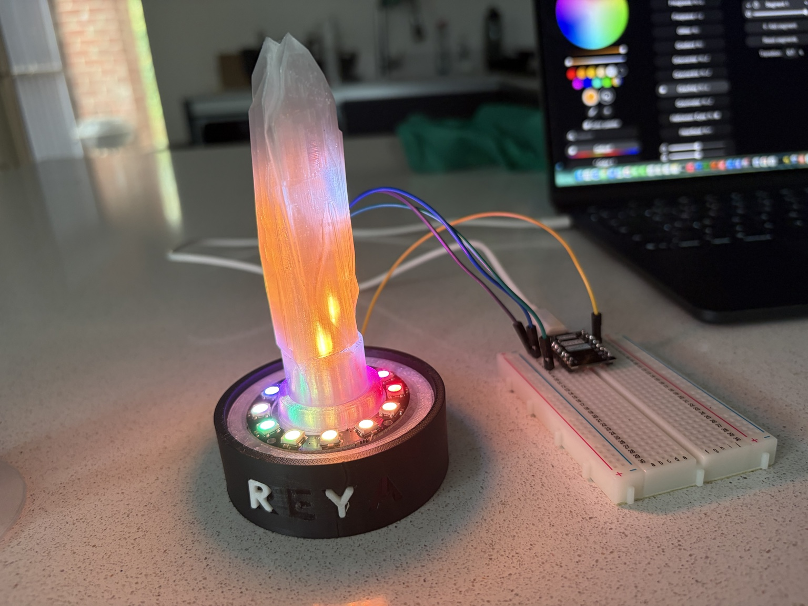
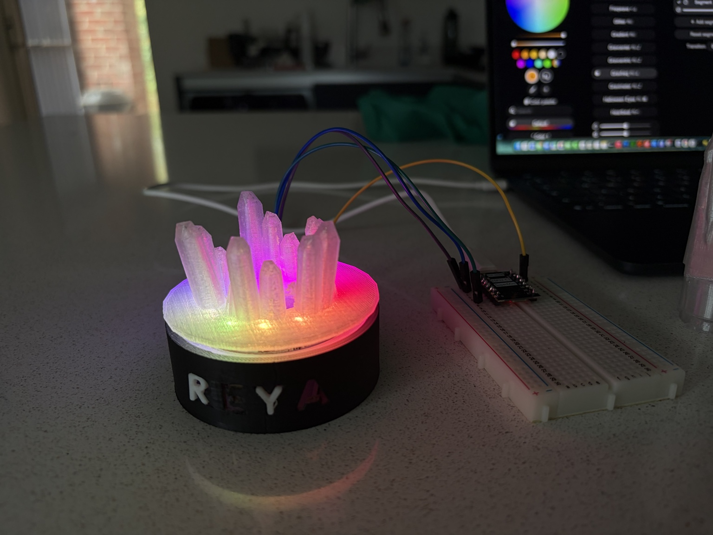

# 🔮 Kyber Crystal Night Light

A removable, 3D-printed illuminated crystal combining custom CAD, addressable LEDs, an ESP32-C3 and a magnetic pogo-pin docking interface. This  was spurred by the birth of my friend's child. Eventually, I hope to be able to place the crystal element into a lightsaber to power it up. I wanted to design something that would have multiple uses over a few years with the crystal being key to both the nightlight, and saber elements. Still a work-in-progress!

## The idea

The crystal is designed to sit in a custom base without a permanent cable.

```text
          REMOVABLE CRYSTAL
       ┌─────────────────────┐
       │  3D-printed crystal │
       │  WS2812B lighting   │
       └──────────┬──────────┘
                  │
          magnetic pogo pins
                  │
       ┌──────────▼──────────┐
       │         BASE        │
       │      ESP32-C3       │
       │    power / control  │
       └─────────────────────┘
```

Drop the crystal into the stand, it self-aligns and the electrical connection is made through the magnetic pogo contacts.

## Hardware

- ESP32-C3 Mini
- WS2812B addressable LEDs
- USB-C power / battery hardware
- Magnetic pogo-pin contacts
- 3D-printed crystal
- 3D-printed base / docking hardware

## Mechanical design

The design was developed iteratively in OpenSCAD.

### CAD render — crystal



### CAD render — engineering disc



### CAD render — top insert



## Build progression

### Prototype



### Disassembled



### LED base



### Installed



### Geode variant



## CAD files

The `cad/` directory contains the current OpenSCAD sources and STL exports, including:

- Crystal shaft
- Crystal foot / base
- Engineering disc
- Diffusion plate
- Diffusion collar
- LED shaft
- Crystal body exports

There are multiple versioned files because the mechanical design was developed iteratively rather than as a single one-shot model.

## Electronics

The ESP32-C3 controls the addressable LED lighting. The removable crystal and base are electrically coupled through the magnetic pogo interface, keeping the visible object clean and cable-free.

## Design challenge

The interesting engineering problem was the interface between mechanical design and electronics. The dock had to provide repeatable alignment, reliable electrical contact and easy removal while hiding the electronics inside the base, and simultaneously, the dock design has to be consistent for any future designs, ie, the lightsaber.

The result is effectively a small **docking station for a light source**.
