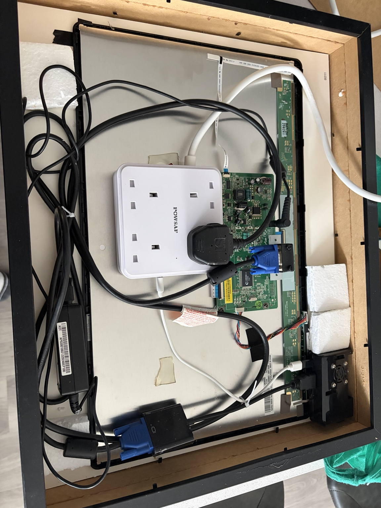

# 🪞 Magic Mirror

A Raspberry Pi-powered smart mirror built from an old Dell monitor, mirror material and IKEA frames.

## What I built

I stripped the original monitor housing and built the display into a physical mirror enclosure using two IKEA frames. The power hardware and display adapters were packaged behind the mirror so the finished object looked more like furniture than a computer project.

The Raspberry Pi runs the MagicMirror ecosystem with scheduled automation and custom configuration.

## Features

- QR code for the home Wi-Fi network
- Local bus, Tube and train information
- Calendar information
- News headlines
- Cryptocurrency information
- Scheduled behaviour using cron
- Customised modules and layout

## Hardware

- Raspberry Pi 2 Model B
- Old Dell monitor
- VGA-to-HDMI adapter
- Internal power supply
- Two IKEA frames
- Mirror / reflective front

## Software

- Linux
- MagicMirror
- Docker
- SSH
- Cron

## Build photos

### Finished mirror

### Inside the frame

### Running

## What I learned

The interesting part was the integration: display hardware, Linux, power, networking, automation and physical construction all had to coexist inside a relatively small enclosure.
