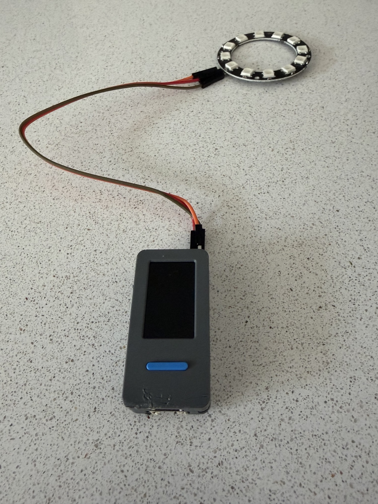
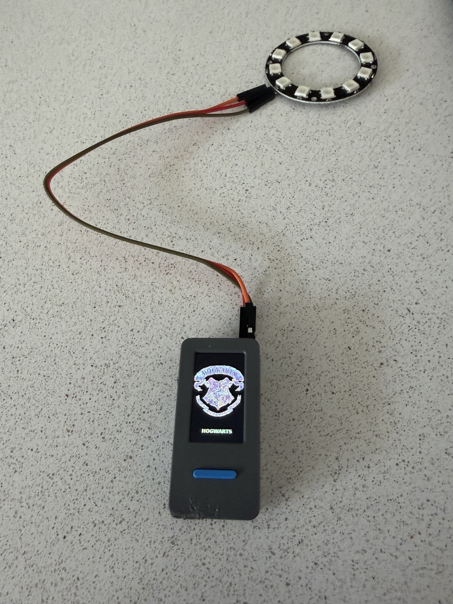
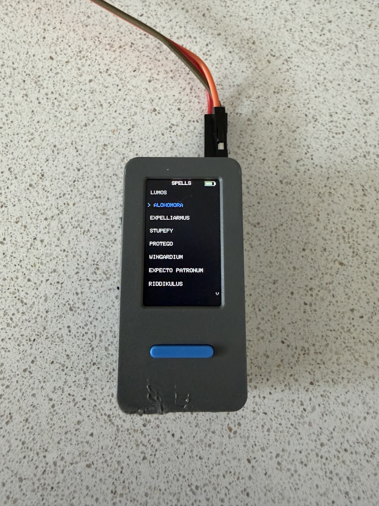
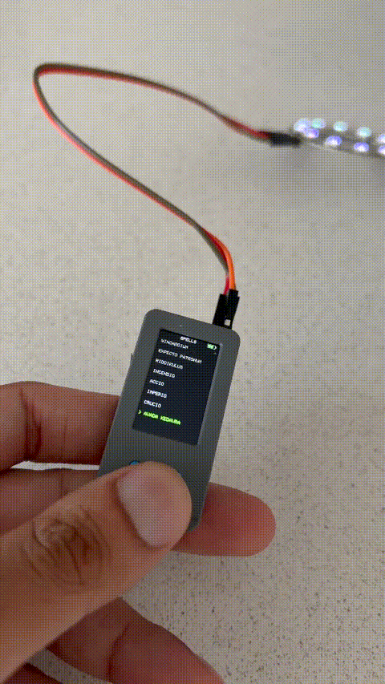

# 🪄 Motion-Tracked Spell Wand — Prototype

**Status: 🚧 In development**

After my nephew became a Potterhead this summer, I wanted to build him his own wand so he can practice casting spells. A separate lock-box is also planned, incorporating a servo-driven latch mechanism activated by one of the spells.

The project started as an M5Stick-based embedded prototype exploring motion-driven spell selection and casting.

The physical wand enclosure has not been printed yet. The embedded/software prototype is already functional, using the controller's motion sensing to interact with a list of spells and trigger programmed effects.

## Prototype





The prototype uses an M5Stick controller with a display, physical control and an addressable LED ring for visualisation. The final version will replace the ring with a single addressable LED at the tip of the wand.

## Spell Interface

The current firmware presents a selectable spell list including:

- Lumos
- Alohomora
- Expelliarmus
- Stupefy
- Protego
- Wingardium
- Expecto Patronum
- Riddikulus



## Motion → Spell Pipeline

```text
IMU / accelerometer
        ↓
motion detection
        ↓
gesture / flick recognition
        ↓
spell selection
        ↓
cast
        ↓
LED + display effect
```

The aim is to turn physical wand movement into a recognisable embedded interaction, rather than relying solely on buttons or a touchscreen.

## Demo



The prototype demonstrates the controller, spell interface and addressable LED effects working together.

## Firmware

The firmware implements:

- Spell selection and navigation
- IMU / accelerometer input
- Motion and gesture detection
- Spell casting logic
- Addressable LED effects
- Display graphics and feedback
- Battery monitoring

[View the firmware →](wand_imu_spells.ino)

## Hardware

- M5Stick controller
- Onboard IMU / accelerometer
- Integrated display
- Physical button input
- Addressable LED ring
- Battery-powered operation

## Current State

The embedded prototype is functional, but the final physical wand has not yet been manufactured.

The current setup is being used to develop and validate the electronics, firmware and interaction model before integrating everything into the wand enclosure.

## Next Steps

- Design the 3D-printed wand enclosure
- Integrate the M5Stick and battery into the wand
- Replace the prototype LED ring with a single addressable LED at the wand tip
- Refine the gesture/casting interaction
- Design and print the spell lock-box
- Add a servo-driven lock mechanism triggered by a spell

The core interaction is already proven at prototype level:

**sensor input → embedded logic → spell selection/casting → physical output**
