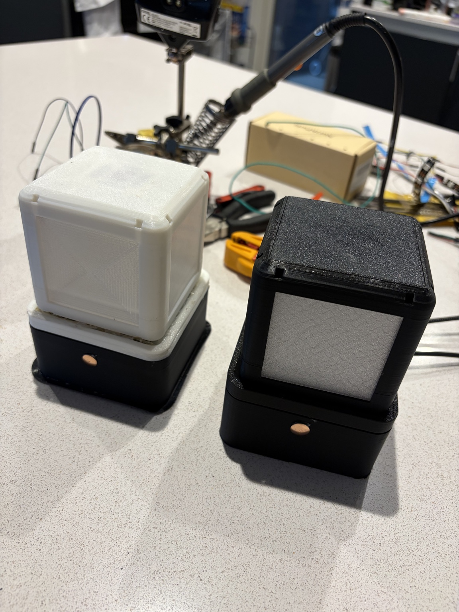
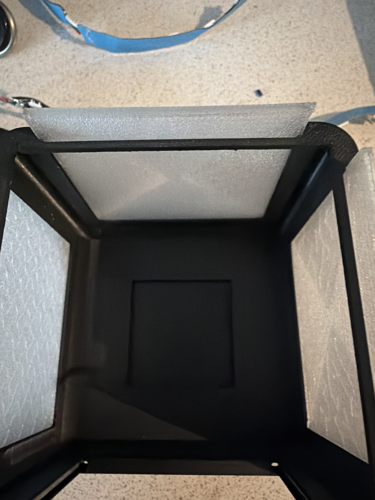
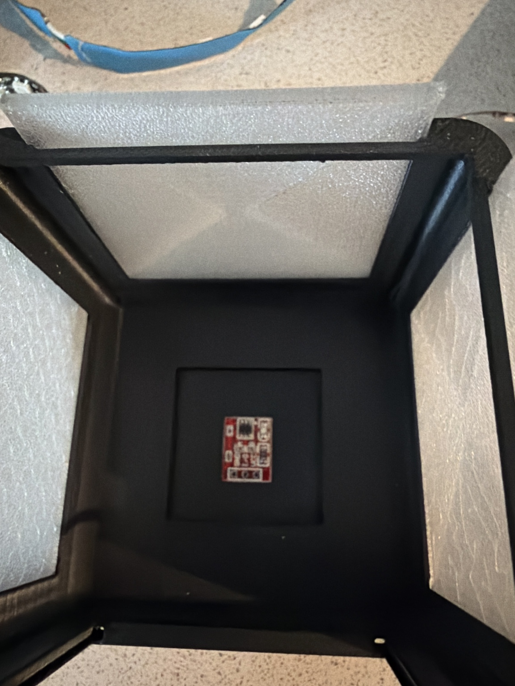
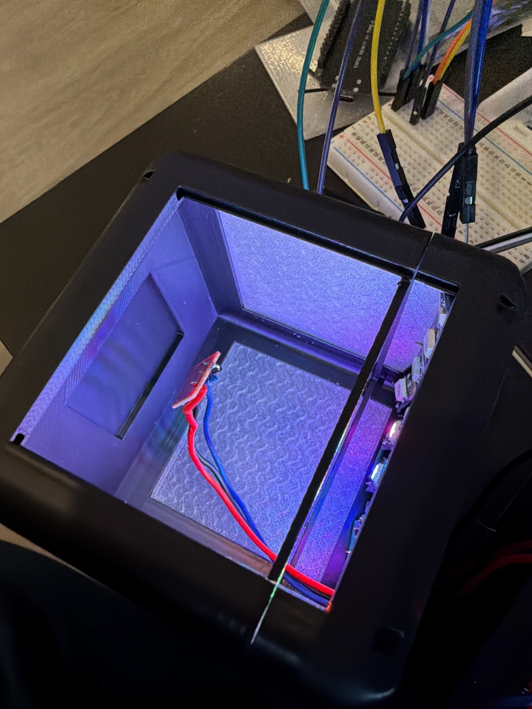
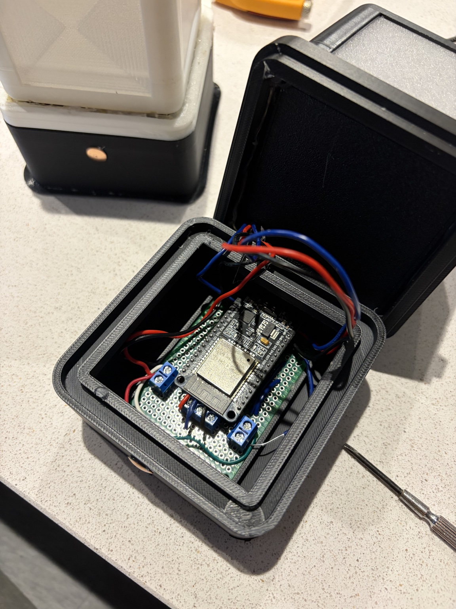

# 💡 Wi-Fi Touch Lamps

A pair of custom 3D-printed touch lamps combining capacitive sensing, addressable LEDs, Wi-Fi and MQTT.

## Concept

```text
Touch
  │
  ▼
TTP223 capacitive sensor
  │
  ▼
NodeMCU
  │
  ├──► LED control
  │
  └──► Wi-Fi / MQTT
          │
          ▼
     Other networked devices
```

## Hardware

- NodeMCU / ESP8266
- TTP223 capacitive touch sensor
- Addressable LEDs
- 3D-printed lamp enclosure

## Software / connectivity

- Wi-Fi
- MQTT
- Microcontroller firmware
- Addressable LED control

## Features

- Touch-controlled lighting
- Network control via MQTT
- LED colour feedback
- Custom 3D-printed enclosure
- Two lamps designed to operate as networked devices

## Build photos











## What I like about it

The interesting part isn't any individual component. It's the chain:

**physical input → microcontroller → network → MQTT → lighting behaviour**

The project was a small way of exploring how a simple physical interface can become part of a distributed IoT system.
